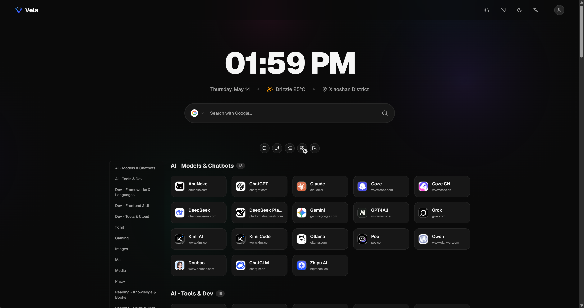
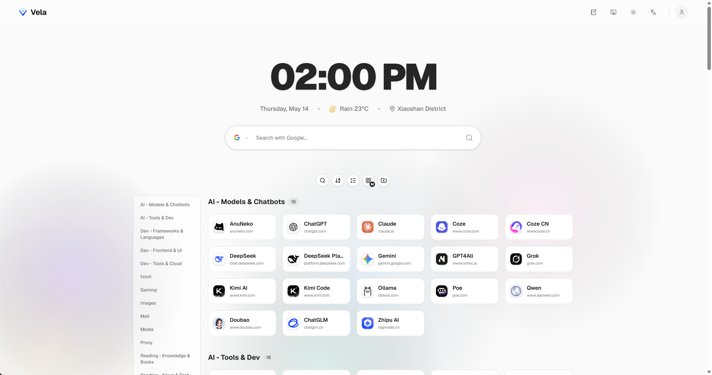
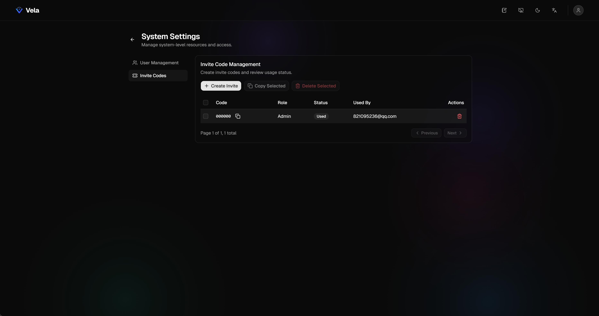
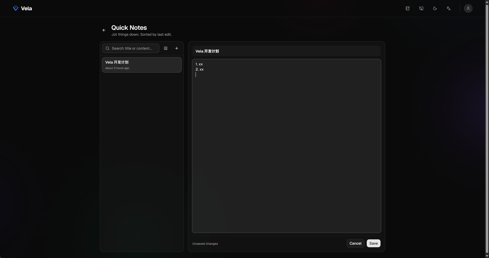
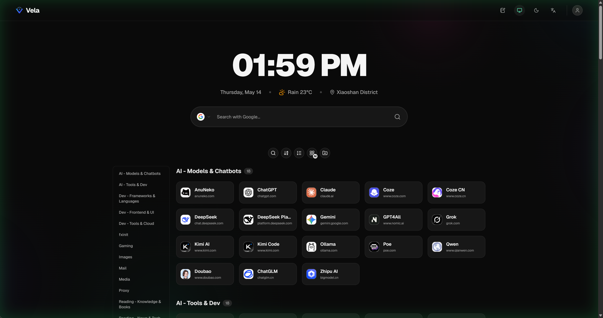

# Vela

[README](./README.md) | [中文说明](./README.zh.md)

Vela 是一个适合自部署的个人导航工作台。它用于管理常用网站、导入浏览器书签、记录速记内容，并支持多用户、邀请注册、角色权限、主题切换和中英文界面。

## 预览







## 主要功能

- 导航链接分组、搜索、排序和卡片尺寸切换
- 浏览器书签 HTML 文件导入
- 速记页面，用于保存轻量文本
- 邀请码注册，默认不开放自由注册
- 多用户和角色权限，管理员可管理用户和邀请码
- 首页时间、天气、搜索、保持屏幕常亮
- 数据存储在 SQLite，适合个人服务器或 NAS 自托管

## Docker 部署

要求：Docker 24+，并支持 Compose 插件。

```sh
git clone https://github.com/wallace921029/vela.git
cd vela
cp .env.example .env
```

编辑 `.env`：

```env
JWT_SECRET=请替换为一段足够长的随机字符串
INITIAL_INVITE_CODE=000000
```

启动：

```sh
docker compose up -d --build
```

访问：

```text
http://localhost:10000
```

首次注册使用 `INITIAL_INVITE_CODE`。该邀请码被使用后，再修改 `.env` 中的值不会自动创建新的邀请码；后续邀请码请在系统设置中生成。

## 本地开发

要求：Node.js 22+。

```sh
npm install
npm --prefix backend install
cp .env.example .env
npm run dev
```

访问：

- 前端：`http://localhost:5173`
- 后端：`http://localhost:3000`

常用命令：

```sh
npm run dev              # 同时启动前后端
npm run build            # 构建后端和前端
npm run build:frontend   # 只构建前端
npm run build:backend    # 只构建后端
npm run lint             # 运行 ESLint
```

## 更新前备份数据库

更新前建议先停止服务并备份数据库。项目使用 SQLite WAL 模式，数据库相关文件可能不止一个。

Docker 部署时，数据库在宿主机：

```text
./data/
```

本地开发时，数据库在：

```text
backend/db/
```

需要备份的文件：

```text
vela.db
vela.db-wal
vela.db-shm
```

如果服务已经停止，直接备份整个目录最稳妥：

```sh
docker compose down
cp -a ./data ./backup-data-$(date +%Y%m%d-%H%M%S)
```

在 Windows PowerShell 中可以使用：

```powershell
docker compose down
Copy-Item -Recurse -Force .\data ".\backup-data-$(Get-Date -Format yyyyMMdd-HHmmss)"
```

本地开发环境则把 `./data` 替换为 `./backend/db`。

## 更新部署

推荐流程：

```sh
docker compose down
cp -a ./data ./backup-data-$(date +%Y%m%d-%H%M%S)
git pull
docker compose up -d --build
docker compose logs -f --tail=100
```

确认页面和登录正常后，可以保留最近几份备份，删除更旧的备份目录。

## 恢复数据库

恢复前先停止服务：

```sh
docker compose down
```

将备份目录中的数据库文件复制回数据目录：

```sh
cp -a ./backup-data-YYYYMMDD-HHMMSS/. ./data/
docker compose up -d
```

Windows PowerShell：

```powershell
docker compose down
Copy-Item -Recurse -Force ".\backup-data-YYYYMMDD-HHMMSS\*" .\data\
docker compose up -d
```

恢复时请确保 `vela.db`、`vela.db-wal`、`vela.db-shm` 来自同一次备份，避免 SQLite 数据不一致。

## 安全说明

- `JWT_SECRET` 必须使用长随机字符串，不要使用默认值。
- 不要提交 `.env`、数据库文件或备份目录。
- 如果修改 `JWT_SECRET`，所有已登录用户的旧 token 都会失效，需要重新登录。
- 建议通过反向代理启用 HTTPS。
- 定期备份 `./data` 或 `backend/db`，尤其是在升级、迁移服务器和修改数据库前。
- `INITIAL_INVITE_CODE` 只用于首次初始化；邀请码被使用后，请在系统设置中生成新的邀请码。

## 许可证

[MIT](./LICENSE) © 2026 Uzhi
